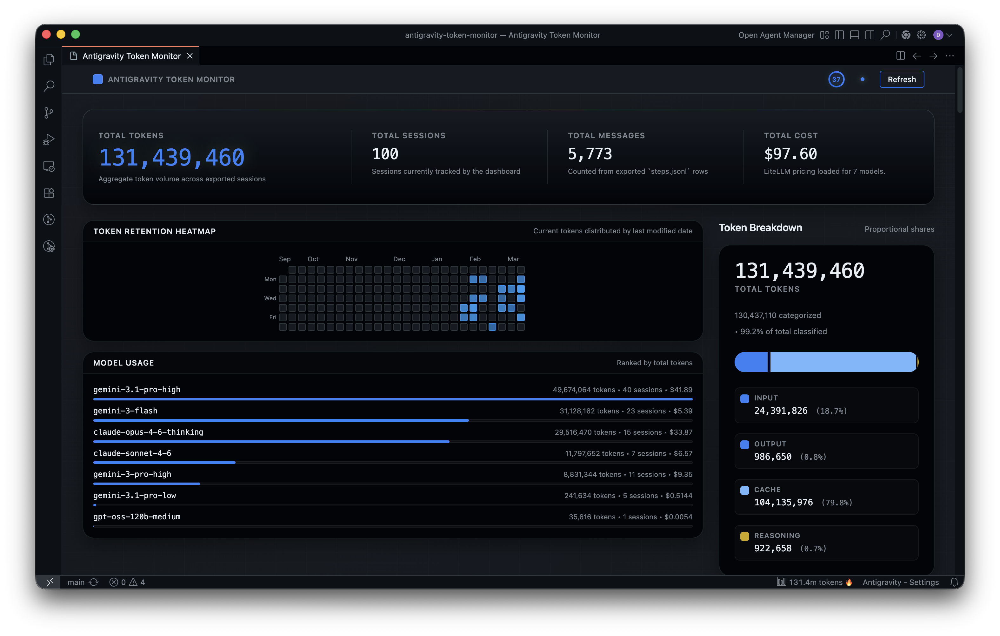

# Antigravity Token Monitor (Token 消耗监控面板)

[](https://code.visualstudio.com/)
[](https://www.typescriptlang.org/)
[](https://svelte.dev/)
[](https://opensource.org/licenses/MIT)

[English](readme.md) | **[简体中文](README_zh.md)** | [한국어](README_ko.md)

> 实时监控 Antigravity 会话的 Token 消耗、模型分布与费用预估的可视化仪表盘插件。



**Antigravity Token Monitor** 是一款专为 [Antigravity](https://blog.google/technology/google-deepmind/) 打造的 VS Code 扩展插件。它能够自动采集、解析和可视化你在编码会话中的 **Token 使用量**。通过连接运行中的 Antigravity 进程内部 RPC，将 Token 元数据导出为本地 JSONL 产物，并通过基于 Svelte 构建的现代化数据看板与常驻状态栏提供全面的洞察。

---

## 🌟 核心特性

- 🔥 **实时 Token 监控** — 自动追踪所有 Antigravity 编码会话的实时 Token 增量与消耗
- 📅 **多维度时间筛选** — 支持切换 **全部时间 / 今天 / 近 24 小时 / 近 7 天 / 近 30 天 / 自定义日期选择器**，全局联动重新统计
- 📈 **高反差翡翠绿热力图** — 近 180 天活跃度日历，采用四分位数动态分级算法与高辨识度阶梯配色，直观掌握峰值与趋势
- 🏷️ **4 色高辨识度 Token 构成** — 采用科技蓝（输入）、翡翠绿（输出）、电光紫（缓存）、琥珀橙（思考推理）清晰呈现各类型占比
- 💰 **模型精准费用预估** — 结合 [LiteLLM](https://github.com/BerriAI/litellm) 开源定价数据，精确统计各模型专属成本与调用次数
- 📌 **侧边栏常驻监控** — 在 Activity Bar 中提供轻量微型面板（KPI、Token 构成、模型使用、30天热力图、会话列表）
- 🖥️ **状态栏实时计数** — 在 VS Code 底部状态栏始终显示当前 Token 总数，悬浮即可查看明细
- 🪟 **全平台兼容支持** — 完美支持 Windows（PowerShell WMI 进程定位与端口探测）、macOS 及 Linux
- 🌐 **全界面中文汉化** — 命令、设置项、状态栏、主仪表盘及侧边栏均已完整汉化
- 🔒 **多实例安全保护** — 文件级锁机制（PollLock），避免多个 VS Code 窗口重复刷新与冲突

---

## ⚠️ 免责声明

> [!WARNING]
> - 本项目为**非官方社区开源项目**，与 Google 没有任何隶属或背书关系。
> - 本插件依赖 Antigravity 进程的内部 RPC 接口，若 Antigravity 后续版本发生变更，相关接口可能失效。
> - 费用预估基于 [LiteLLM 开源价格表](https://github.com/BerriAI/litellm)，仅供参考，**请勿作为财务决策依据**。
> - 插件仅向本地 `127.0.0.1` 发起 HTTPS 请求与 Antigravity 通信，不会向任何外部服务器上传数据。

---

## 🚀 快速上手

### 环境要求
- [VS Code](https://code.visualstudio.com/) `≥ 1.96.0` 或 Antigravity IDE
- [Node.js](https://nodejs.org/) `≥ 18`

### 安装方法

#### 方式 1：直接安装打包文件 (.vsix)
1. 从 Release 页面下载 `antigravity-token-monitor-0.0.17.vsix`；
2. 在 IDE 中按 `Ctrl + Shift + P`（Mac: `Cmd + Shift + P`）；
3. 输入并选择 `Extensions: Install from VSIX...`，选中下载的文件即可完成安装。

#### 方式 2：从源码编译
```bash
# 克隆仓库
git clone https://github.com/THE-XSX/antigravity-token-monitor.git
cd antigravity-token-monitor

# 安装依赖
npm install

# 编译插件与打包
npm run compile
npm run package
```

---

## 💻 快捷命令

| 命令名称 | 说明 |
| :--- | :--- |
| `Antigravity Token Monitor: 打开监控仪表盘` | 打开主 Webview 数据分析大屏 |
| `Antigravity Token Monitor: 立即刷新数据` | 手动触发全量会话重新扫描与解析 |
| `Antigravity Token Monitor: 立即导出 RPC 会话` | 强制通过 RPC 导出所有会话数据 |
| `Antigravity Token Monitor: 重置数据缓存` | 清除本地分析缓存并从头重新计算 |

---

## ⚙️ 扩展设置

所有配置项均位于 VS Code 设置中的 `antigravity-token-monitor.*`：

| 配置项 | 默认值 | 说明 |
| :--- | :--- | :--- |
| `sessionRoot` | 自动检测 | Antigravity 会话根目录路径 |
| `pollIntervalMs` | `60000` | 自动后台轮询与重新扫描间隔（毫秒） |
| `historyLimit` | `120` | 每个会话保留的历史快照上限 |
| `useRpcExport` | `true` | 是否启用内部 RPC 进行元数据导出 |
| `exportStepsJsonl` | `false` | 是否同时导出对话具体步骤（调试用途） |

---

## 📄 开源许可

本项目遵循 [MIT License](LICENSE.txt) 开源协议。
